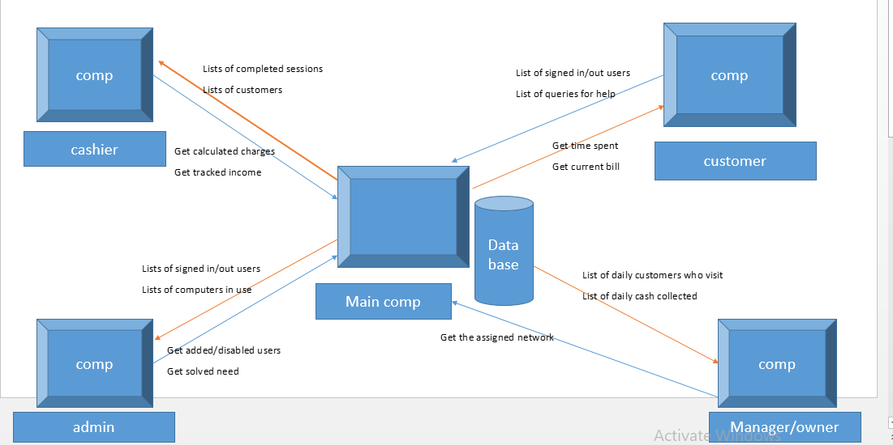

# Joy's cyber design architecture

## Customer Session Manager
This is a standalone frontend system written in java that will post customers browsing session start and stop to the database backend.
The customer session manager will also have an option for calling for help from the administrator.
### Features
1. Start a browsing Session
2. Seek assistance from the administrator
3. view time spent on current customer session
4. View amount billed on current customer session
5. Make payment
6. End a browsing session

## cashier 
This is a standalone frontend system written in java that will get list of customers and their charges to the database backend.
The cashier session manager will also have an option for tracking cyber cafe income.
### Features
1. View list of customers currently in the cyber
2. Calculate charges
3. Collect money based on usage by customers
4. Track cyber cafe income

## Administrator 
This is a standalone frontend system written in java that will put requests for help from customers,patch the changed passwords and get the total number of computers to the database backend.
The administrator session manager will also have an option for adding/editing and disabling users of the system.
### Features
1. Briefly view total number of computers
2. View/acknowledge requests for help from customers
3. Add/edit and disable users of the system
4. Add/update the computers

## Manager/owner 
This is a frontend system written in PHP that will post number of customers,usage duration and daily cash collected in the cyber to the database backend.
The owner session manager will also have an option for assigning internet in the system.
### Features
1. view number of customers
2. view customers usage duration
3. view daily cash collected
4. Assign internet

## Database 
This is a backend system written in MYSQL that will post all the tracked information of computers from the frontends.
The database session manager will serve as the centre of information in the system.
### Features
#### customer
1. Get time spent
2. Get current bill
3. Get answers for the queries
#### cashier
1. Get completed sessions
2. Get total number of customers
3. Get calculated charges
#### administrator
1. Get total number of computers in use
2. Get signed in/out users
#### manager/owner
1. Get daily cash collected
2. Get daily number of customers
3. Get customers usage duration

